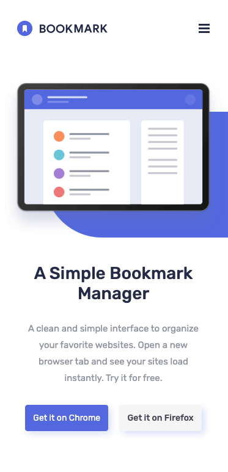
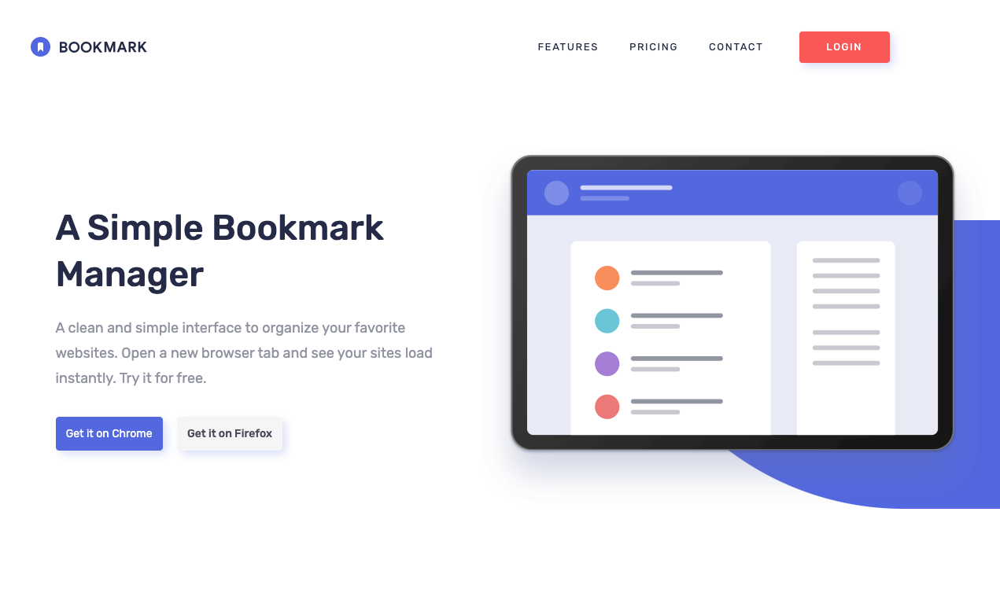

# Frontend Mentor - Bookmark landing page solution

This is a solution to the [Bookmark landing page challenge on Frontend Mentor](https://www.frontendmentor.io/challenges/bookmark-landing-page-5d0b588a9edda32581d29158). Frontend Mentor challenges help you improve your coding skills by building realistic projects.

## Table of contents

- [Overview](#overview)
  - [The challenge](#the-challenge)
  - [Screenshot](#screenshot)
  - [Links](#links)
- [My process](#my-process)
  - [Built with](#built-with)
  - [What I learned](#what-i-learned)
  - [Continued development](#continued-development)
  - [Useful resources](#useful-resources)
- [Author](#author)

## Overview

### The challenge

Users should be able to:

- View the optimal layout for the site depending on their device's screen size
- See hover states for all interactive elements on the page
- Receive an error message when the newsletter form is submitted if:
  - The input field is empty
  - The email address is not formatted correctly

### Screenshot

Mobile

Desktop

### Links

- Solution URL: [https://github.com/kennbach/bookmark-landing-page](https://github.com/kennbach/bookmark-landing-page)
- Live Site URL: [https://kennbach.github.io/bookmark-landing-page/](https://kennbach.github.io/bookmark-landing-page/)

## My process

### Built with

- Semantic HTML5 markup
- CSS
- CSS Variables
- CSS Grid
- Vanilla JavaScript
- Desktop-First workflow
- Accessibility Aware

### What I learned

lorem

### Continued development

ipsum

### Useful resources

- [link title](url) - Description

## Author

- Github - [kennbach](https://github.com/kennbach)
- Frontend Mentor - [@kennbach](https://www.frontendmentor.io/profile/kennbach)
